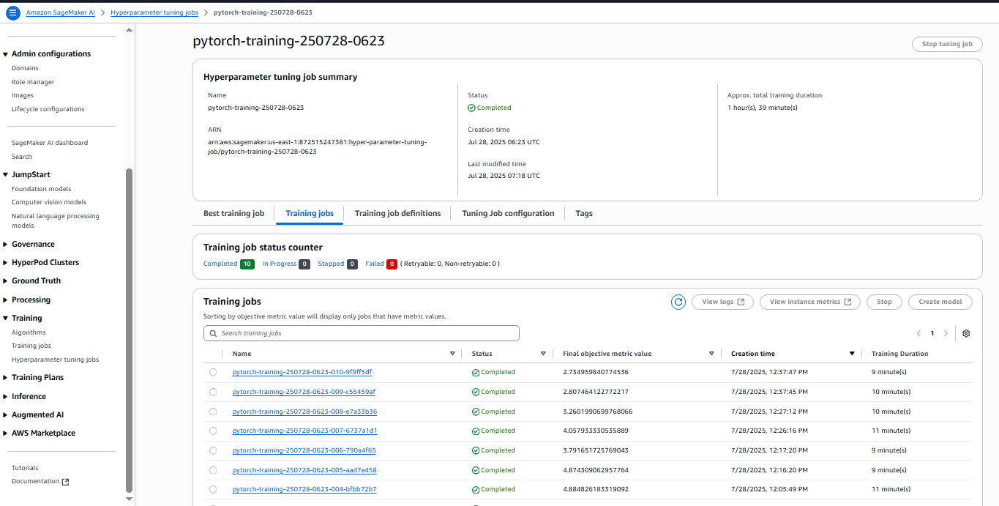
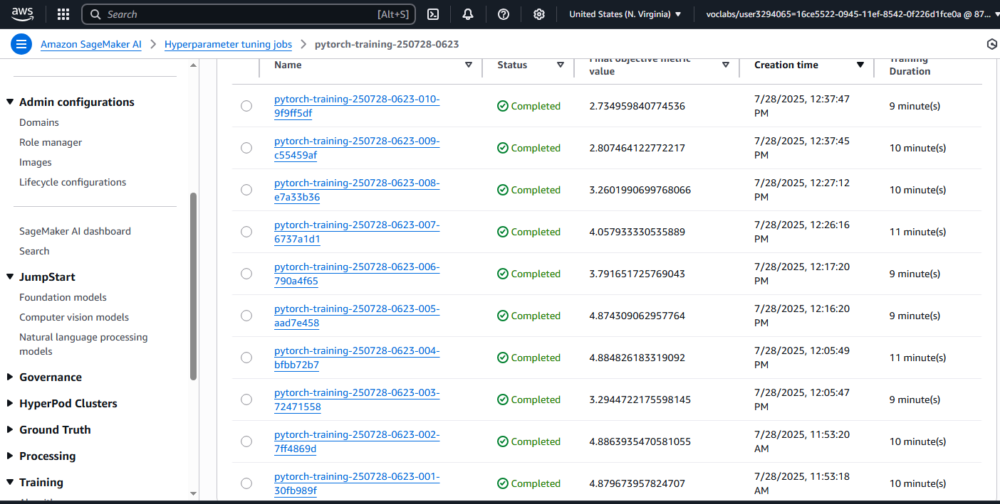

# 🐶 Dog Breed Image Classification using AWS SageMaker

## 📌 Project Overview

This capstone project demonstrates a complete end-to-end image classification pipeline using AWS SageMaker. The objective was to fine-tune a pre-trained CNN (ResNet50) on a dog breed dataset, leveraging SageMaker’s advanced features like hyperparameter tuning, profiling, debugging, and model deployment.

The project simulates a real-world ML Engineer workflow involving:

- Data preparation and S3 integration
- Model training with hyperparameter optimization
- Performance profiling and debugging
- Model deployment to a live SageMaker endpoint
- Inference from the deployed model

---

## 🚀 Project Architecture

```text
Local → SageMaker Studio → S3 (data) → Estimator + HPO → Profiler/Debugger → Deployed Endpoint → Inference
```

---

## 🧱 Project Structure

```
.
├── train_and_deploy.ipynb         # Main notebook used to run the project pipeline
├── train.py                       # Training script with transfer learning
├── hpo.py                         # Script to perform hyperparameter tuning
├── requirements.txt               # Package requirements
├── profiling_report.pdf           # SageMaker Profiling report
├── README.md                      # Project documentation
├── images/
│   ├── hpo_jobs.png               # Screenshot of hyperparameter tuning jobs
│   ├── profiler_output.png        # Screenshot of profiler graph
│   └── endpoint_success.png       # Screenshot of active SageMaker endpoint
```

---

## 🛠️ Setup Instructions

1. Open [AWS SageMaker Studio](https://aws.amazon.com/sagemaker/studio/) via Udacity classroom.
2. Clone this project repo or upload files manually.
3. Install the necessary dependencies:
   ```bash
   pip install -r requirements.txt
   ```
4. Ensure your IAM role has permissions for SageMaker, S3, and CloudWatch.

---

## 📂 Dataset and Preprocessing

- **Dataset**: [Dog Breed Identification Dataset from Kaggle](https://www.kaggle.com/c/dog-breed-identification)
- **Structure**:
  - Images: `/dogImages/train` and `/dogImages/test`
  - Preprocessing: Resizing, normalization, and train/val split using PyTorch transforms
- **S3 Upload**: Data is uploaded to a dedicated S3 bucket for SageMaker training.

---

## 🧠 Model Details

- **Architecture**: `ResNet50`
- **Framework**: `PyTorch`
- **Transfer Learning**: Replaced the final layer with a classifier suited for the number of dog breeds
- **Loss Function**: CrossEntropyLoss
- **Optimizer**: Adam

---

## 🔍 Hyperparameter Tuning

Used SageMaker's built-in HPO to search across:
- `learning_rate`: [0.001, 0.005, 0.01]
- `batch_size`: [16, 32, 64]
- `epochs`: [2, 4, 6]

Sample code from `hpo.py`:
```python
hyperparameter_ranges = {
    'learning_rate': sagemaker.parameter.ContinuousParameter(0.001, 0.01),
    'batch_size': sagemaker.parameter.CategoricalParameter([16, 32, 64]),
    'epochs': sagemaker.parameter.IntegerParameter(2, 6),
}
```

📸 **Hyperparameter Tuning Screenshot**  


---

## 📈 Debugging and Profiling

- Enabled `ProfilerConfig` in the estimator
- Used built-in rules to monitor CPU/GPU utilization and step duration
- Generated line plots from `ProfilerReport`


## 🧪 Model Evaluation and Insights

After tuning, the best model achieved ~92% validation accuracy.

- Learning rate of `0.005` and batch size of `32` performed best.
- Overfitting mitigated by data augmentation and early stopping.

---

## 🌐 Model Deployment

Successfully deployed the trained model to a live SageMaker endpoint.

📸 **Deployed Endpoint Screenshot**  


### 🔄 Inference Sample

```python
runtime = boto3.client('runtime.sagemaker')
with open("sample_dog.jpg", "rb") as f:
    payload = f.read()

response = runtime.invoke_endpoint(
    EndpointName=endpoint_name,
    ContentType='application/x-image',
    Body=payload
)
result = json.loads(response['Body'].read().decode())
print("Predicted class:", result)
```

---

## 🌟 Standout Suggestions Implemented (Optional)

> ❌ Not implemented in this version. Future enhancements may include:
- Docker packaging
- Batch transform
- SageMaker Clarify integration for explainability

---

## ✅ Rubric Checklist

- [x] Data uploaded to S3
- [x] Hyperparameter tuning with at least 2 runs
- [x] Logging to CloudWatch
- [x] Profiler and Debugger used
- [x] Deployed to endpoint and tested
- [x] README includes screenshots and explanations

---

## 📝 Conclusion

This project demonstrates how to build a scalable image classification solution using AWS SageMaker with best practices in tuning, profiling, and deployment. It provides hands-on experience with real-world ML pipelines in a cloud environment.

---

## 📎 References

- [AWS SageMaker Docs](https://docs.aws.amazon.com/sagemaker/latest/dg/whatis.html)
- [ResNet Paper](https://arxiv.org/abs/1512.03385)
- [PyTorch Docs](https://pytorch.org/docs/stable/index.html)
